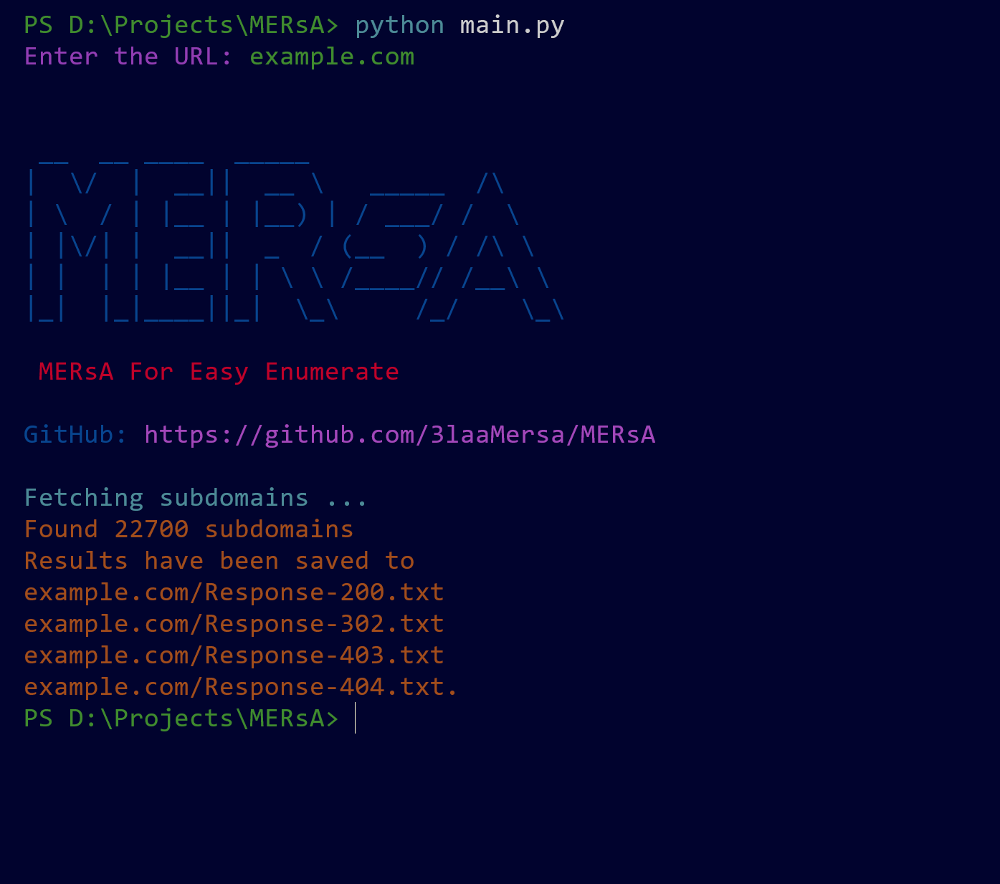

# MERsA

MERsA is a Simple Python tool designed to make it easy to discover subdomains of a given URL using `subfinder`, and then analyze their HTTP responses using `httpx`. It saves the results categorized by HTTP response codes into separate text files for easy analysis.
---
## Features

- **Subdomain Discovery**: Utilizes `subfinder` to fetch subdomains of a specified URL.
- **HTTP Response Analysis**: Uses `httpx` to categorize subdomains based on their HTTP response codes (200, 302, 403, 404).
- **File Output**: Saves results into respective files (`Response-200.txt`, `Response-302.txt`, `Response-403.txt`, `Response-404.txt`) under a directory named after the main domain.

## Requirements

Ensure you have the following installed:

- Python 3.x
- `subfinder` (Install with `go get -v github.com/projectdiscovery/subfinder/v2/cmd/subfinder`)
- `httpx` (Install with `python3 -m pip install httpx`)

## Usage

1. Clone the repository:

```bash
git clone https://github.com/3laaMersa/MERsA.git
cd MERsA
```

1. Install dependencies:

```bash
python3 -m pip install -r requirements.txt
```

1. Run the script:

```bash
python3 main.py
```

1. Enter the URL when prompted:

```bash
Enter the URL: https://example.com
```

1. View results:
- Check the created directory named after the main domain (e.g., `example.com`).
- You will find files `All_Subdomains.txt`, `Response-200.txt`, `Response-302.txt`, `Response-403.txt`, `Response-404.txt` containing respective subdomains and their HTTP responses.

### Example

Let's analyze subdomains for `https://example.com`:

```bash
python3 main.py
Enter the URL: https://example.com
```

Output:

```css
Fetching subdomains ...
Found 15 subdomains
Results have been saved to
example.com/Response-200.txt
example.com/Response-302.txt
example.com/Response-403.txt
example.com/Response-404.txt.
```

In this example, `15 subdomains` were discovered and categorized based on their HTTP responses.



## Notes

- Ensure `subfinder` and `httpx` are properly installed and accessible via the command line.
- This tool is intended for educational and professional security testing purposes.
